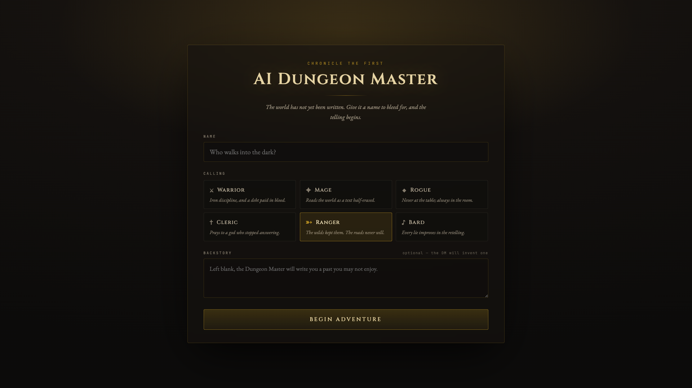
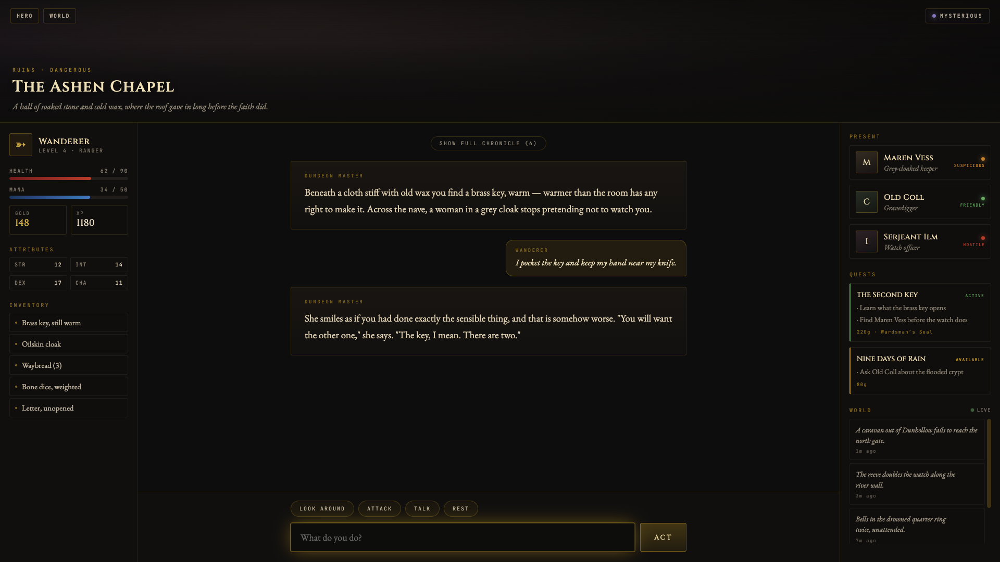
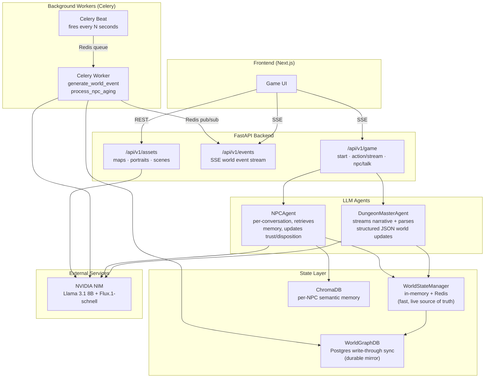

# AI Dungeon Master

An infinite, procedurally generated dark-fantasy RPG powered by LLMs — a Dungeon Master agent narrates the world and reacts to player actions in real time, NPCs hold persistent memories of past interactions, and the world keeps evolving autonomously even when the player is idle.

Built by **Pratham Taneja**.

---

## Table of Contents

- [Overview](#overview)
- [Screenshots](#screenshots)
- [Architecture](#architecture)
- [Tech Stack](#tech-stack)
- [Key Design Decisions](#key-design-decisions)
- [Project Structure](#project-structure)
- [Getting Started](#getting-started)
- [Evaluations](#evaluations)
- [Known Limitations](#known-limitations)

---

## Overview

Most LLM-powered "AI DM" demos are a single chat loop bolted onto a prompt. This project is a full multi-service system:

- **A streaming Dungeon Master agent** that narrates the world and returns structured world-state updates alongside natural-language text, parsed live as tokens arrive.
- **Per-NPC agents with long-term memory** — every NPC remembers past conversations via a ChromaDB-backed semantic memory store, retrieving only what's relevant to the current exchange (a RAG system applied to game memory instead of documents).
- **A world that evolves without the player** — a Celery-scheduled background process periodically generates world events and ages NPC patience on unresolved quests, independent of any player action.
- **A dual persistence layer** — a fast in-memory/Redis layer for live gameplay, write-through synced to Postgres for durability.
- **On-demand multimodal generation** — location maps, NPC portraits, and per-turn scene illustrations, generated via NVIDIA NIM (Flux.1-schnell), with graceful SVG-placeholder fallback if generation fails.
- **Live narration and ambient audio** — DM narrative is spoken aloud via the Web Speech API, and a mood-reactive ambient soundscape is synthesized live via the Web Audio API, with zero external audio files.

---

## Screenshots

| Character creation | Live gameplay |
|---|---|
|  |  |

---

## Architecture



**Request flow for a player action:**

1. Frontend sends the action to `POST /game/action/stream`.
2. `DungeonMasterAgent` builds a prompt from the live world state + conversation history, streams the LLM's response token by token via SSE.
3. As tokens arrive, narrative text is forwarded immediately; a trailing JSON block (scene mood, location changes, item gains, etc.) is detected, held back from the stream, and parsed once the response completes — with a defensive, multi-stage extraction pass (fenced block → fence-less brace-matching → truncation repair) for reliability against a small, occasionally-inconsistent model.
4. The parsed update mutates the in-memory `GameSession`, which is saved to Redis and synced to Postgres.
5. A final structured `world_update` event is sent to the frontend to update the UI, including a scene image prompt that triggers on-demand image generation.

**Autonomous events, independently:** Celery Beat fires every `world_event_interval_seconds`, fanning out one task per active session. Each task calls the LLM for a short world event, writes it to Redis and Postgres, and publishes it to a Redis pub/sub channel — which a long-lived SSE connection (`/events/world/{session_id}`) is subscribed to and forwards straight to the browser, live, with no polling.

---

## Tech Stack

| Layer | Technology |
|---|---|
| Backend framework | FastAPI (async), Uvicorn |
| LLM orchestration | LangChain + NVIDIA NIM (Llama 3.1 8B Instruct) |
| Image generation | NVIDIA NIM (Flux.1-schnell) |
| Embeddings / memory | ChromaDB + HuggingFace `all-MiniLM-L6-v2` (local, no API key needed) |
| Live state | Redis (cache + Celery broker + pub/sub) |
| Durable storage | PostgreSQL, SQLAlchemy (async), Alembic migrations |
| Background jobs | Celery (worker + beat) |
| Frontend | Next.js (App Router), TypeScript, Web Speech API, Web Audio API |
| Infra | Docker Compose (Postgres, Redis, backend, Celery worker, Celery beat, frontend) |

---

## Key Design Decisions

**Fast in-memory state, durable Postgres mirror.** Gameplay reads/writes against an in-memory dict backed by Redis, so turns never wait on a database round-trip. Every mutation is also write-through synced to Postgres via `WorldGraphDB`, so nothing is lost on a server restart. Redis itself degrades gracefully — a circuit-breaker flag stops retrying a dead Redis connection instead of slowing down every subsequent save, falling back to memory-only durability for that session.

**Defensive, multi-stage parsing around LLM output.** The DM's structured JSON is extracted through a layered fallback: a fenced-block regex match, then brace-matching extraction for responses missing a closing fence, then a truncation-repair pass that closes unterminated strings/objects. Every individual field (dispositions, health deltas, quest updates) is parsed defensively with safe fallbacks, wrapped so one malformed field can't crash a whole turn. This layered approach was validated and iterated on using a purpose-built eval (see [Evaluations](#evaluations)) — a real bug in the original fence-only extraction was found, fixed, and confirmed via isolated testing.

**RAG for NPC memory, not full conversation history.** Instead of stuffing an NPC's entire chat history into every prompt, interactions are summarized to one sentence, embedded, and stored in a per-NPC, per-session ChromaDB collection. Only the top-K most semantically relevant memories are retrieved for the current exchange — bounding both prompt size and cost as a session grows.

**Two backend "brains" that stay decoupled.** The Dungeon Master agent and the Celery background worker both call the LLM, but never share state directly — they communicate only through Redis (as a queue, a cache, and a pub/sub channel), since a Celery worker runs as a fully separate process from the FastAPI app and can't share Python objects in memory with it.

**Style-anchored prompts for visual consistency.** Every generated image (map, portrait, scene) is prefixed with a fixed style description, so independently generated assets share a consistent visual language rather than drifting in style turn to turn.

**Graceful degradation over hard failures, throughout.** Missing Postgres at startup doesn't crash the app. A failed image generation falls back to a themed SVG placeholder rather than a broken image. A failed memory write is logged, not raised. The philosophy across the whole system: prefer a slightly degraded experience over an interrupted one.

---

## Project Structure

```
backend/
├── agents/          # DM + NPC LLM agents, prompt templates
├── api/              # FastAPI routes (game, events, assets)
├── assets/           # Multimodal generation pipeline
├── evals/             # JSON reliability + NPC memory recall evaluations
├── memory/           # ChromaDB-backed NPC memory (RAG)
├── models/           # Pydantic schemas
├── tasks/            # Celery background jobs
├── world/            # Live state manager + Postgres sync layer
├── alembic/           # Database migrations
├── config.py, database.py, dependencies.py, main.py
├── terminal_game.py   # CLI smoke-test harness (no server required)
└── requirements.txt

docker/
└── docker-compose.yml # Full local stack: Postgres, Redis, backend, Celery, frontend

dungeon-master-ui/      # Next.js frontend
```

---

## Getting Started

```bash
# 1. Clone
git clone https://github.com/Pratham-taneja/AI-Dungeon-Master.git
cd AI-Dungeon-Master

# 2. Configure environment
cp backend/.env.example backend/.env
# Add your NVIDIA_API_KEY (free tier: https://build.nvidia.com)

# 3. Run the full stack
cd docker
docker-compose up

# Backend: http://localhost:8000/docs
# Frontend: http://localhost:3000
```

**Quick smoke test without Docker/frontend**, once dependencies are installed and Postgres/Redis are running locally:
```bash
cd backend
alembic upgrade head
python terminal_game.py
```

---

## Evaluations

Two focused evals live in `backend/evals/`, each measuring a specific reliability mechanism rather than a generic "is the output good" score. Full methodology and usage in `backend/evals/README.md`.

### DM structured-output JSON reliability

Across multiple 20-turn eval runs (`evals/json_reliability.py`), the DM's structured JSON block parses successfully (clean or recovered via repair) in **50-65% of turns**, with the best observed run reaching **65% success (35% failure)**. Three distinct failure modes were identified through manual diagnostic testing:

1. **Empty JSON body** — the opening ` ```json ` fence is present but no content follows.
2. **Missing JSON block entirely** — the model completes the narrative and stops, omitting the structured-output instruction altogether.
3. **Malformed nested structures** — e.g. `items_gained` occasionally generated as a list of objects instead of the required flat list of strings, breaking bracket matching.

None of these are extraction-logic bugs: isolated testing confirmed the JSON extraction logic (`_extract_json_block` in `agents/dm_agent.py`) correctly recovers 100% of responses where valid JSON is present but missing its closing fence — a real gap that existed in the original implementation, found via this eval, and fixed. The remaining failures reflect genuine output inconsistency in the 8B-parameter model under real narrative-generation load; prompt tuning (reordering instructions, explicit anti-patterns) improved reliability but did not eliminate these modes. The natural next step would be a schema-constrained/guided generation approach (e.g. function calling, if supported by the model endpoint) rather than further prompt engineering, or a larger model.

### NPC memory retrieval accuracy (recall@K)

`evals/memory_recall_eval.py` seeds 8 known facts as NPC memories, then queries each with a differently-worded follow-up to test whether the semantic (ChromaDB) retrieval — not exact keyword match — surfaces the right memory. Fully offline, no API key required.

**Result: 8/8 (100%) recall@K.** Every query — despite sharing no exact wording with the memory it was meant to retrieve (e.g. memory: *"admitted to being afraid of the dark forest"*, query: *"How does the player feel about traveling into dangerous woods?"*) — correctly surfaced the relevant memory in the top-K results. This is a meaningfully more reliable result than the JSON eval, which makes sense given the task shapes: semantic similarity search over a small, local embedding model is a far more constrained and deterministic operation than an 8B LLM reliably emitting complex nested structured output — the two evals intentionally stress-test very different parts of the system.

---

## Known Limitations

- Autonomous world events (Celery background tasks) and player-driven turns both sync to Postgres, but the Celery path uses a short-lived, per-call database engine rather than the app's shared connection pool, since Celery tasks run in their own event loop per invocation.
- Alembic migrations and the SQLAlchemy `Base.metadata.create_all()` startup path both define the schema; in practice `create_all()` is what runs at app startup, with Alembic available for any future schema changes.
- Scene image generation does not yet fall back to a placeholder on failure the way map/portrait generation does.
- DM structured-output reliability sits at roughly 50-65% success on a small 8B model; see [Evaluations](#evaluations) for full detail and root causes.
- The NPC dialogue modal does not visually replay prior conversation history when reopened — the NPC's actual responses still reflect real ChromaDB memory, but the UI starts each visit with a blank slate.
